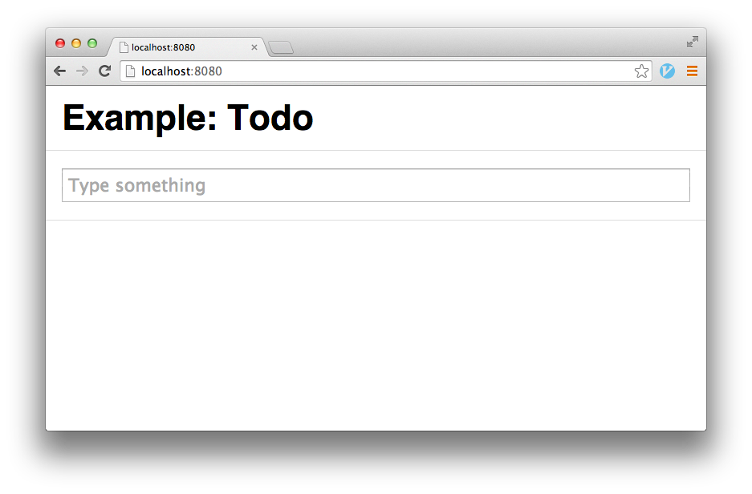

# Scaffolding the application

we will create the following files in a single directory:

- [`/index.html`](./index.html)
- [`/application.js`](/application.js)
- [`/indexeddb.shim.min.js`](/indexeddb.shim.min.js)
- [`/styles.css`](/styles.css)
- [`/offline.appcache`](/offline.appcache)

### `/index.html`

```html
<!DOCTYPE html>
<html>
  <head>
    <link rel='stylesheet' href='./styles.css' type='text/css' media='all' />
  </head>
  <body>
    <h1>Example: Todo</h1>
    <form>
      <input placeholder="Type something" />
    </form>
    <ul>
    </ul>
    <script src="./indexeddb.shim.min.js"></script>
    <script src="./application.js"></script>
  </body>
</html>
```

Nothing surprising here: just a standard HTML web page, with an input field to add to-do items, and an empty unordered list that will be filled with those items.

### `/indexeddb.shim.min.js`

Download the contents of [the minified IndexedDB polyfill](https://raw.githubusercontent.com/matthew-andrews/offline-todo/gh-pages/indexeddb.shim.min.js)
, and put it in this file.

### `/styles.css`

```css
body {
  margin: 0;
  padding: 0;
  font-family: helvetica, sans-serif;
}

* {
  box-sizing: border-box;
}

h1 {
  padding: 18px 20px;
  margin: 0;
  font-size: 44px;
  border-bottom: solid 1px #DDD;
  line-height: 1em;
}

form {
  padding: 20px;
  border-bottom: solid 1px #DDD;
}

input {
  width: 100%;
  padding: 6px;
  font-size: 1.4em;
}

ul {
  margin: 0;
  padding: 0;
  list-style: none;
}

li {
  padding: 20px;
  border-bottom: solid 1px #DDD;
  cursor: pointer;
}
```

Again, this should be quite familiar: just some simple styles to make the to-do list look tidy. You may choose not to
have any styles at all or create your own.

## Quick test

Run any simple static web server, for example [node-static](https://github.com/cloudhead/node-static), in the directory
containing these files and verify the website matches the screenshot below.


