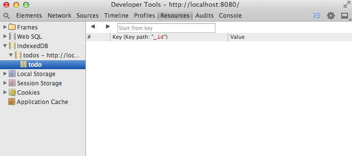

# Creating object stores

Like many database formats that you might be familiar with, you can create many tables in a single IndexedDB database. These tables are called **objectStores**. In this step, we’ll create an object store named `todo`. To do this, we simply add an event listener on the database’s `upgradeneeded` event.
The data format that we will store to-do items in will be JavaScript objects, with two properties:

`timeStamp` This timestamp will also act as our key.
`text` This is the text that the user has entered.

For example:
```
{ timeStamp: 1407594483201, text: 'Wash the dishes' }
```

Now, `/application.js` looks like this (the new code starts at `request.onupgradeneeded`):

```js
(function() {

  // 'global' variable to store reference to the database
  var db;

  databaseOpen
    .then(function() {
      alert("The database has been opened");
    });

  function databaseOpen() {
    return new Promise(function(resolve, reject) {
      var version = 1;
      var request = indexedDB.open('todos', version);

      // Run migrations if necessary
      request.onupgradeneeded = function(e) {
        db = e.target.result;
        e.target.transaction.onerror = databaseError;
        db.createObjectStore('todo', { keyPath: 'timeStamp' });
      };
  
      request.onsuccess = function(e) {
        db = e.target.result;
        resolve();
      };
      request.onerror = reject;
    }
  });
}());
```

This will create an object store keyed by `timeStamp` and named `todo`.

## Or will it?

Having updated `application.js`, if you open the web app again, not a lot happens. The code in `onupgradeneeded` never runs; try adding a `console.log` in the `onupgradeneeded` callback to be sure. The problem is that we haven’t incremented the version number, so the browser doesn’t know that it needs to run the upgrade callback.

## How to solve this?

Whenever you add or remove object stores, you will need to increment the version number. Otherwise, the structure of the data will be different from what your code expects, and you risk breaking the application.
Because this application doesn’t have any real users yet, we can fix this another way: by deleting the database. Copy this line of code into the **Console**, and then refresh the page:

```js
indexedDB.deleteDatabase('todos');
```

After refreshing, the **Resources** pane of **Developer Tools** should have changed and should now show the object store that we added:
The Resources panel should now show the object store that was added.



[Continue to *adding data* →](../05-adding-data)
