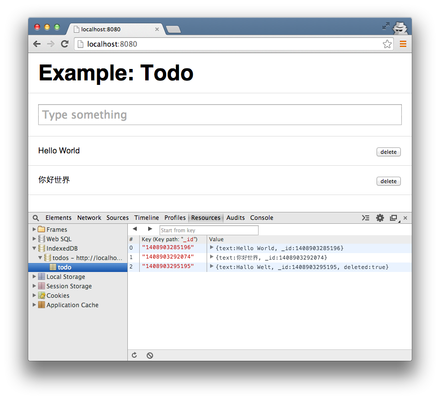

# Marking items for deletion

Rather than directly deleting todo items we need to change our client side code to *mark todos for deletion*.

To achieve this we are going to need to make the following changes to `application.js`:

- change the `onClick` handler, which deletes individual todos, from directly deleting the todo to setting a new `deleted` property to `true`
- enhance the `databaseTodosGet` method so that todos can be filtered by their deleted status.
- update `refreshView`'s use of `databaseTodosGet` so that it only renders undeleted todos.
- we won't delete the `databaseTodosDelete` method, even though it is now unused as the synchronisation logic that we will implement later will make use of it.

##### `application.js`

```js
[…]

  function onClick(e) {
    e.preventDefault();
    if (e.target.hasAttribute('id')) {
      databaseTodosGetById(e.target.getAttribute('id'))
        .then(function(todo) {
          todo.deleted = true;
          return databaseTodosPut(todo);
        })
        .then(refreshView);
    }
  }

[…]

  function refreshView() {
    return databaseTodosGet({ deleted: false }).then(renderAllTodos);
  }

[…]

  function databaseTodosGet(query) {
    return new Promise(function(resolve, reject) {
      var transaction = db.transaction(['todo'], 'readwrite');
      var store = transaction.objectStore('todo');

      var keyRange = IDBKeyRange.lowerBound(0);
      var cursorRequest = store.openCursor(keyRange);

      var data = [];
      cursorRequest.onsuccess = function(e) {
        var result = e.target.result;

        if (result) {
          if (!query || (query.deleted === true && result.value.deleted) || (query.deleted === false && !result.value.deleted)) {
            data.push(result.value);
          }
          result.continue();

        } else {
          resolve(data);
        }
      };
    });
  }

[…]
```

Assuming nothing has broken the application should continue working in exactly the same way it did before - you should be able to create and delete todos.  The difference is an implementation detail that can be checked by opening up dev tools - where you will see that todos don't actually get deleted any more - they only have a `deleted` flag set to `true` against them.  See below:



---

[← Back to *architecture*](../01-architecture) | [Continue to *adding ajax* →](../03-adding-ajax)
