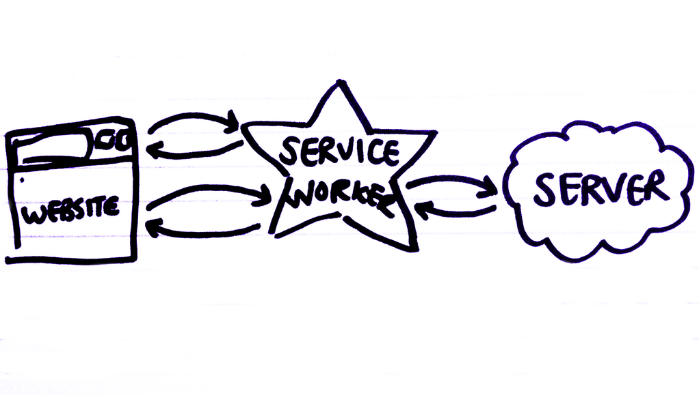

# Offline news with Service Worker

To get AppCache to work with our offline news website required us to write so many awful confusing hacks:-

- Varying the response of every page based on whether a cookie is set;
- Returning an HTTP error on the manifest when a cookie is not set;
- Created an iframe to load a page that loads the manifest rather than referencing it directly.
- Without the `NETWORK: *` hack in your AppCache manifest you will break all non-offline'd resources.

Luckily, a better way is coming.

## Service Workers

Service Workers are a new web browser feature that enable developers to write scripts that run independently from web pages, similar to shared workers, and are shared between web pages on the same domain name.

- They run **independently** from web pages, in the background
- They are **shared** between different URLs on the same domain.
- A domain can have **multiple** Service Workers.
- They can be **shut down** at the end of events.
- They are able to **intercept** and **manipulate** HTTP requests between the web application and the internet.
- They have their own mechanism to **cache requests** (in addition to the existing browser cache).
- They can enable websites to **work offline** because they are able to respond to requests and respond from a cache without an internet connection.
- They will probably [only be permitted on websites served over **https**](https://github.com/slightlyoff/ServiceWorker/issues/199).

Service Workers are meant to replace the HTML5 Application Cache. Unlike AppCache, which is controlled by [adding specific entries into a manifest file](https://developer.mozilla.org/en/docs/HTML/Using_the_application_cache), Service Workers are written in Javascript.

Or, in visual form:-

